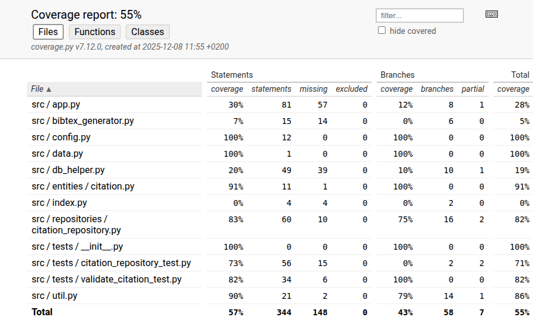

### Yksikkötesti raportti

Tiedostoja on 3, joita pitää yksikkötestata:

- citation_repository_test.py
- tag_repository_test.py
- validate_citation_test.py

## citation_repository_test.py

Yksikkötestit testaavat citation_repository-tiedoston toimivuutta. Tiedosto hoitaa viitteiden sql-kyselyt, sekä tietokannan muokkaamista. Testit tehdään käynnistämällä sovelluksen ja muodostamalla uuden tietokannan jonka jälkeen haetaan, lisätään tai päivitetään tietokantaa.

## tag_repository_test.py

Yksikkötestit testaavat tag_repository-tiedoston toimivuutta. Tiedosto hoitaa tagien sql-kyselyt, sekä tietokannan muokkaamista. Testit tehdään käynnistämällä sovelluksen ja muodostamalla uuden tietokannan jonka jälkeen haetaan, lisätään tai päivitetään tietokantaa.

## validate_citation_test.py

Yksikkötestit testaavat syötteet viiteiden tietokantaan. Yksikkötestit tarkistavat, että vialliset viitteiden syötteet ei lisätä tietokantaan. Syötteitä tarkastetaan util-tiedoston 'validate_citation'-funktion sekä UserInputError-luokan avulla.

Projektin testikattavuus on keskimäärin yli 70%, joista kaikki sovelluslogiikkaan liittyviä ohjelmia testataan perusteellisesti yli 90 prosentin testikattavuudella

